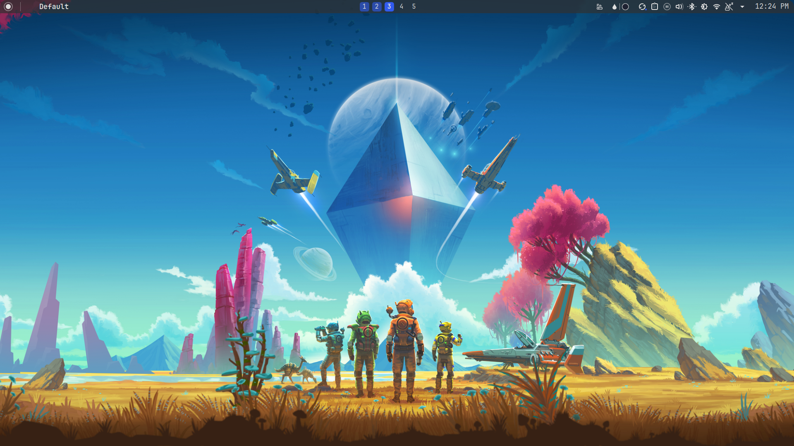
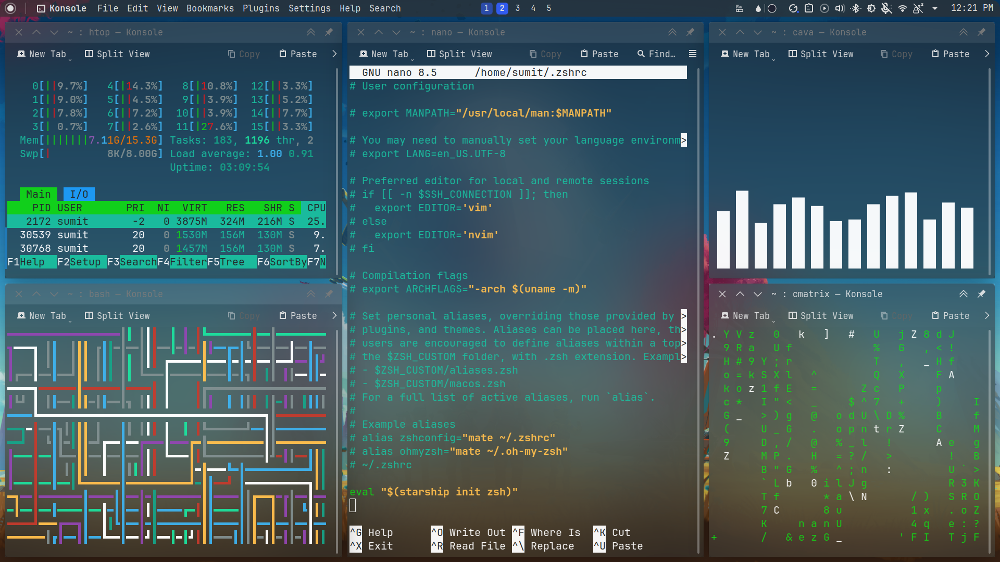

# My KDE plasma setup

A mini dotfiles repository that will remind me my KDE Plasma workflow.





## Details

### Font:

- Jetbrain mono nerd [font](https://www.nerdfonts.com/font-downloads)

- `Plasma Style`: [WhiteSur-dark](https://github.com/vinceliuice/WhiteSur-kde)
- `Application Style`: [Darkly](https://github.com/Bali10050/Darkly)
  - Center tabbar tabs ✅
  - Draw widget shadow ✅
  - Transparent dolphin ✅
  - 60% opaqueness
- `Window Decorations`: Darkly
- `Colors`: [Custom](local/share/color-schemes)
- `Icon theme`: [Tela](https://github.com/vinceliuice/Tela-icon-theme)
- `Cursor theme`: [Vimix](https://github.com/vinceliuice/Vimix-cursors)
- `Wallpaper`: [No Man's Sky : NEXT 8k Ultrawide](https://wall.alphacoders.com/big.php?i=921802)
- `Login Screen`: SDDM
- `Splash Screen`: Fedora minimalist
- `Widgets`
  - Default Application menu
  - Window title fork [Link](https://store.kde.org/p/2147882)
  - Global Menu
  - Virtual Desktop indicator [Kara](https://github.com/dhruv8sh/kara)
  - Panel Colorizer [Link](https://github.com/luisbocanegra/plasma-panel-colorizer)
  - Color Picker
  - Default System Tray
  - Digital Clock
- ##Desktop Effects (System Settings -> Window Management -> Desktop Effects)
- [Better Blur](https://github.com/taj-ny/kwin-effects-forceblur)
  Here's a list of apps I added to the classes inside Better Blur configs:

```
dolphin
systemsettings
zen
app.zen_browser.zen
plasmashell
konsole
kvantummanager
org.kde.spectacle
discord
org.inkscape.Inkscape
Yad
kate
org.kde.plasma-systemmonitor
org.kde.ark
org.kde.discover
org.kde.haruna
rofi
spotify
steam
```

### Terminal

1. htop
2. [pipes.sh](https://github.com/pipeseroni/pipes.sh)
3. Audio Visualizer [Cava](https://github.com/pipeseroni/pipes.sh)
4. Matrix [cmartrix](https://github.com/abishekvashok/cmatrix)
5.
